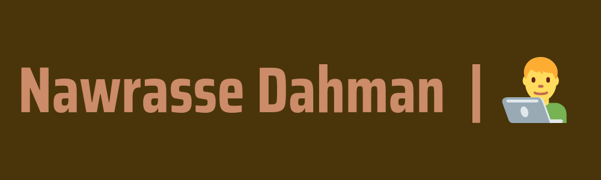

## 

  
  
- 🤖 | Currently Working On [**Everything**](https://github.com/NawrasseDahman)

- 👑 | Founder & CEO Of [**Urban SASS**](https://github.com/UrbanSASS)

- 🧠 | Currently Learning **Everything**

- 👨‍💻 | Check Out My [**Website**](https://nawrasse.vercel.app/) **If You Want To Know More About Me**

- 🌟 | Check Out My [**Projects**](https://github.com/NawrasseDahman?tab=repositories) **If You Want To More About Them**

- 🤩 | Looking To Collaborate With **More Developers**

- 🗣️ | Ask Me About **Programming Languages**

- 📧 | How To Reach Me: **nawrassehimself@gmail.com**

- ☑️ | Random Fact: **I'm Also Available For Hire**

- 🎞️ | Fun Fact: **I Can Remember All Of The Realeased Dates Of Movies & Tv Shows**

##

### My Open Source Projects:

  
  
  
  
  
  

  

##

### Most Used Languages:

##

### Connect With Me:

<code></code>
<code></code>
<code></code>
<code></code>
<code></code>
<code></code>
<code></code>
<code></code>
<code></code>
<code></code>

##

### Technologies That I Use:

<code></code>
<code></code>
<code></code>
<code></code>
<code></code>
<code></code>
<code></code>
<code></code>
<code></code>
<code></code>
<code></code>
<code></code>
<code></code>
<code></code>
<code></code>
<code></code>
<code></code>
<code></code>
<code></code>
<code></code>
<code></code>
<code></code>
<code></code>
<code></code>
<code></code>
<code></code>
<code></code>
<code></code>
<code></code>
<code></code>
<code></code>
<code></code>
<code></code>

##

### Spotify Presence:

<table width="100%" height="100%"> 
  <tr>
  <td width="100%" height="100%">
 
  
 
  </td>
<table>
